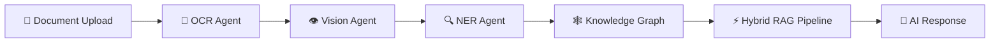

<div align="center">

# ⚡ AEGISAI-DocuMind-AI

### Enterprise Autonomous AI Operating System for Intelligent Document Understanding


<br>


<br><br>


<br>


</div>

---

# 🚀 Overview

AEGISAI-DocuMind-AI is an enterprise-grade AI-powered document intelligence platform designed for autonomous document analysis, hybrid RAG retrieval, knowledge graph construction, multimodal understanding, and intelligent AI workflow orchestration using modern LLM infrastructure.

The platform combines:
- 🧠 Multi-Agent AI Systems
- 🔍 Hybrid RAG Pipelines
- 🕸 Knowledge Graph Intelligence
- 📄 Multimodal Document Processing
- ⚡ Autonomous AI Workflows
- 📊 Enterprise Observability
- 🛡 AI Security & Governance

---

# ⚙️ Core Capabilities

| Capability | Description |
|---|---|
| 🧠 Multi-Agent AI | Autonomous orchestration using CrewAI & LangGraph |
| 🔍 Hybrid RAG | Semantic + Graph-based retrieval pipelines |
| 📄 Document Intelligence | OCR, multimodal understanding, metadata extraction |
| 🕸 Knowledge Graphs | Neo4j-powered relationship construction |
| 🛡 Enterprise Security | JWT auth, RBAC, PII masking |
| 📊 Observability | OpenTelemetry, Prometheus, Grafana |
| ⚡ Local LLMs | Ollama-powered self-hosted AI infrastructure |

---

# 🛠 Tech Stack

<p align="center">


</p>

---

## 🧠 AI Stack

- LangChain
- CrewAI
- LangGraph
- Ollama
- ChromaDB
- Neo4j
- OpenAI API
- Hugging Face Transformers
- PaddleOCR
- Florence-2
- LLaVA

---

# ⚡ Autonomous AI Workflow



---

# 📌 Current Status

| Module | Status |
|---|---|
| Backend Infrastructure | ✅ Completed |
| Multi-Agent Framework | ✅ Completed |
| RAG Pipeline | ✅ Completed |
| OCR Processing | ✅ Completed |
| Vector Database Integration | ✅ Completed |
| Knowledge Graph UI | 🚧 In Progress |
| Agent Memory System | 🚧 In Progress |
| Federated Learning | 🔮 Planned |

---

# 📈 Performance Metrics

| Metric | Performance |
|---|---|
| ⚡ API Latency | `< 200ms` |
| 📄 Document Throughput | `100+ docs/min` |
| 🧠 Entity Extraction Accuracy | `95.2%` |
| 🔍 Graph Query Speed | `< 500ms` |
| 🚀 RAG Response Time | `< 3s` |

---

# 🏗 System Architecture

```text
Frontend (Next.js + TypeScript)
        │
        ▼
FastAPI Backend API Layer
        │
        ▼
Multi-Agent Orchestration Layer
        │
 ┌───────────────┬───────────────┬
 ▼               ▼               ▼
OCR Agent    Vision Agent    NER Agent
 │               │               │
 └───────────────┴───────────────┘
                 ▼
         Knowledge Graph Layer
                 ▼
        Hybrid RAG Retrieval
                 ▼
         Contextual AI Response
```

---

# 📂 Project Structure

<details>
<summary>📁 View Full Project Structure</summary>

```bash
AEGISAI-DocuMind-AI/
│
├── backend/
├── frontend/
├── infrastructure/
├── datasets/
├── agents/
├── orchestration/
├── monitoring/
├── docker/
├── tests/
├── docs/
└── README.md
```

</details>

---

# 🚀 Installation

## Clone Repository

```bash
git clone https://github.com/0DevDutt0/AEGISAI-DocuMind-AI.git

cd AEGISAI-DocuMind-AI
```

---

## Start Using Docker

```bash
docker-compose up --build
```

---

## Backend Setup

```bash
cd backend

pip install -r requirements.txt

uvicorn main:app --reload
```

---

## Frontend Setup

```bash
cd frontend

npm install

npm run dev
```
---

# 📊 Development Activity

<p align="center">
  
</p>

---

# 🐍 Contribution Graph

<p align="center">
  
</p>

---

# 🧪 Future Roadmap

- 🔮 Federated Learning
- 🧠 Long-Term AI Memory
- 🎙 Voice Interaction System
- 🕸 Advanced Knowledge Graph Visualization
- 📊 Enterprise Analytics Dashboard
- 🔐 AI Governance & Compliance
- 🌐 Multi-Tenant Architecture

---

# 👨‍💻 Author

## Devdutt S

- 📧 devduttshoji123@gmail.com
- 💼 https://linkedin.com/in/devdutts
- 🚀 https://github.com/0DevDutt0

---

<div align="center">

### "Building Autonomous AI Systems Beyond Traditional LLM Applications"

</div>
